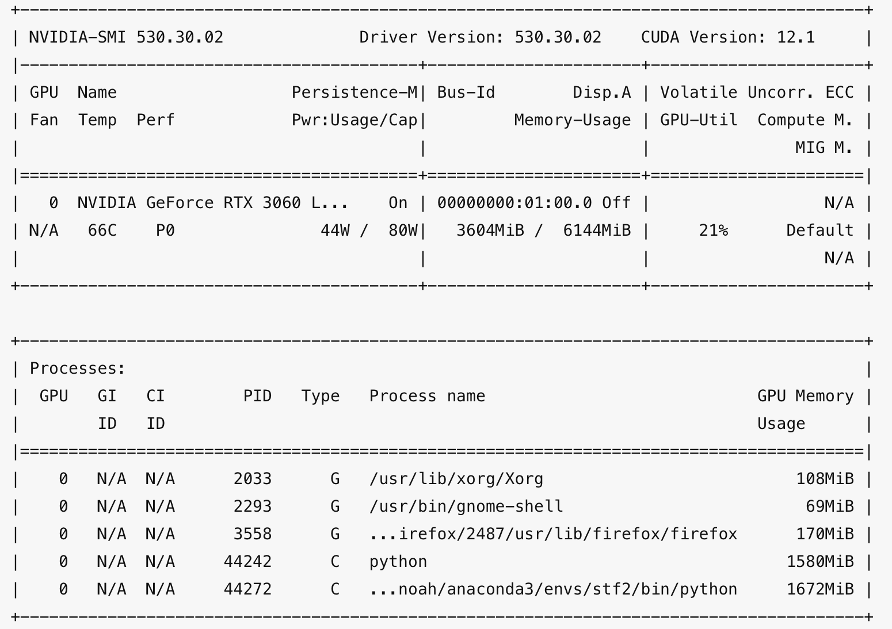

## 姿态识别汇报

----

### 目录

* 背景介绍
* 应用场景
* 解决方案
* 阶段展示
* 后续优化

----

### 背景介绍

* 人体动作姿态的分类
* 人体动作姿态识别的方法

--

#### 人体动作姿态的分类

* 人体运动的识别可以大致分为两种:
    * 姿态识别
      * 姿态识别的对象为静态系统，主要是识别人体整体或者某一部位的姿势。根据识别对象的不同，又可分为手型识别、体势识别、头部姿态识别等。
    * 动作过程识别
      * 动作识别的对象是人体运动的动态过程，例如人体的动作识别、步法识别、手势识别等。

--

#### 人体动作姿态识别的方法

* 人体动作姿态的识别方法可分为三类:
    * 基于统计的方法
      * 基于统计的方法是动态识别系统中效果最好的方法，目前主要是隐马尔可夫模型(HMMs)和动态贝叶斯网络(DBN)两种方法。
    * 基于模板的方法
      * 基于模板的方法主要是模板匹配法、动态时空规整法和动态规划法。
    * 基于语法的方法

----

### 应用场景

* 人体姿态识别的应用范围十分广泛,可用于人机交互、影视制作、运动分析、游戏娱乐等各种领域。
* 人们可以利用人体姿态识别定位人体关节点运动轨迹并记录其运动数据,实现3D动画模拟人体运动来制作电影电视
* 通过记录的轨道和数据对运动进行分析
* 实现人机交互、游戏娱乐,比如体感游戏就是通过对人体运动姿态进行识别来实现游戏互动的。
* ......

----

### 解决方案

* Github开源项目：[智慧教室](https://github.com/hongyaohongyao/smart_classroom)
  * 实现功能
  * 性能分析

--

* 实现功能
  * 课堂专注度分析

  通过检测学生的姿态，识别表情，综合得出学生在课堂上的专注度。

--

* 实现功能
  * 作弊检测
  
  通过识别学生转头、低头与传递物品的动作判断是否存在作弊行为。

--

* 性能分析
  * 模型总大小：约500Mb
  * 实际运行测试

--

* 实际运行测试
  * 环境：
    * 硬件环境：3060laptop 6Gb显存
    * 软件环境：Ubuntu22.04 + CUDA12.1 + Pytorch
  * 帧率：
    * 镜头中有1人时：7-8帧
    * 镜头中有3人时：2-3帧
  * 显存占用：约3Gb
  * 功率：40-60W

--

----

### 阶段展示

* 视频展示

----

### 后续优化

* 提升性能
  * 提升在同一场景下能够识别的学生数量
  * 提升计算效率，提高识别的帧率
* 提升准确率
  * 优化模型，实现对作弊行为的进一步细分
* 融合其它模型
  * 结合人脸识别模型，实现在线点名，监测缺勤情况等功能

----

End
